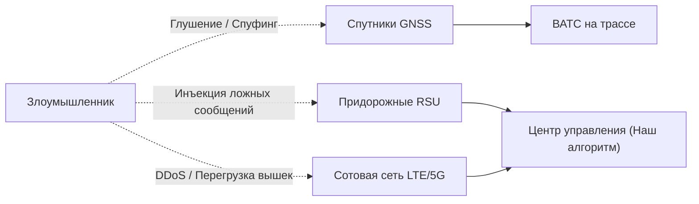

# ⚠️ Системный анализ рисков и уязвимостей в реальной эксплуатации
**Кейс:** «Беспилотный коридор: без права на ошибку»  
**Команда:** VUPSEN Squad | IT Championship NGGTI

---

## 📌 Введение

В условиях хакатона разрабатывается программа централизованного диспетчера для синтетической имитационной модели (шаг 5 секунд, 72 ВАТС, 86 сегментов, 50 датчиков).

Однако при переносе подобной архитектуры на **реальную скоростную автомагистраль** (например, трасса М-11 «Нева», ЦКАД или М-12) система сталкивается с фундаментальными физическими, сетевыми, кибернетическими и организационными вызовами. Настоящий документ представляет глубокий критический анализ потенциальных уязвимостей, угроз и аварийных сценариев.

---

## 1. Временные задержки и физическая инерция (Latency & Blind Driving)

### Суть проблемы
* **Шаг дискретизации 5 секунд + допустимое время ответа 2 секунды + задержки сотовой сети.**
* На крейсерской скорости **90 км/ч (25 м/с)** груженый автопоезд массой 40 тонн за 7 секунд проезжает **175 метров вслепую**.

### Сценарий аварии
Впереди идущее транспортное средство теряет колесо, или на полосу падает груз. Центральный сервер узнает об этом только на следующем пакете наблюдений и сформирует команду торможения/объезда спустя 5–10 секунд от момента инцидента. Тормозной путь 40-тонной фуры на сухом асфальте со скорости 90 км/ч составляет около 60–80 метров. Суммарная дистанция реакции с учетом сетевой задержки превысит **250 метров**, что делает столкновение неизбежным.

### Вывод и архитектурный принцип
> [!IMPORTANT]
> **Центральный сервер не имеет права управлять экстренным торможением и рулением.**  
> В реальной архитектуре разделение обязанностей должно быть жестким:
> * **Борт ВАТС (Onboard Fail-Safe):** автономный контур безопасности на базе LiDAR/радаров/камер со временем реакции 50–100 мс для предотвращения столкновений.
> * **Центральный диспетчер (Наш контур):** макро-логистика, стратегические объезды, прогноз заторов, распределение стоянок и терминалов.

---

## 2. Кибербезопасность и уязвимости каналов связи

Сети V2X (C-V2X / DSRC) и сотовая телеметрия LTE/5G являются открытыми радиоканалами, подверженными радиоэлектронному воздействию.

### Основные векторы атак:

1. **Спуфинг и глушение GNSS (GPS / ГЛОНАСС):**
   * *Уязвимость:* Оценка ODD доверяет заявленному качеству GNSS и координатам.
   * *Атака:* Злоумышленник разворачивает мобильный спуфер. Машина передает в центр ложные координаты, либо система слепо считает, что ВАТС съехало с трассы, и останавливает автопоезд на скоростной полосе.
2. **Компрометация инфраструктурных блоков (RSU Infiltration):**
   * *Уязвимость:* Модули RSU установлены вдоль безлюдных участков дорог и физически уязвимы к перепрошивке или перехвату ключей.
   * *Атака:* Взлом одного RSU позволяет транслировать в сеть фальшивые сигналы обледенения полотна или аварии (`SOURCE_FALSE_CLOSURE`). Если центральный алгоритм чрезмерно перестраховывается, злоумышленник может одной инъекцией **парализовать логистический коридор**, заблокировав движение сотен фур.
3. **Отказ сотовой сети (Cellular Blackout / Denial of Service):**
   * *Уязвимость:* Зависимость от непрерывного потока `stdin`.
   * *Атака / Сбой:* При аварии на базовой станции связи 72 машины одновременно теряют контакт с сервером. В системе обязан присутствовать протокол **«Dead Man’s Switch»**: если ВАТС не получает подтверждения маршрута более $N$ секунд, оно плавно перестраивается в крайнюю правую полосу и снижает скорость до безопасной остановки.

---

## 3. Ресурсные парадоксы и каскадный коллапс (Cascading Failures)

В ТЗ заложены жесткие ресурсные ограничения: **всего 6 операторов поддержки и 10 площадок остановки на 72 машины**. В условиях реальной стихии это источник системной катастрофы.

### Парадокс «Ледяного дождя» (Operator Starvation)
1. На коридор налетает внезапный грозовой фронт или ледяной дождь.
2. Условия выходят за рамки ODD сразу у 25–30 машин профилей `ODD-B` и `ODD-C`.
3. Машины запрашивают удаленную помощь (`remote_support_required`).
4. **Пул поддержки рассчитан только на 6 сессий!**
5. Остальные 20 машин остаются в юридическом и техническом вакууме: они не могут двигаться на автопилоте (запрещено ODD), но и оператора им дать нельзя.

### Эффект домино на площадках безопасной остановки (Safe Stop Overflow)
1. При перекрытии крупного сегмента поток машин направляется на безопасные площадки.
2. Каждая площадка вмещает всего 2–4 автопоезда.
3. Первые 10 фур моментально забивают ближайшие площадки.
4. Последующие машины получают отказ по вместимости.
5. **Итог:** Многотонные автопоезда вынуждены экстренно останавливаться прямо на обочине автомагистрали или на полосе торможения, создавая смертельную угрозу попутного столкновения.

---

## 4. Проблема «слепых зон» и микроклимата

* **Редкая сеть метеостанций (8 станций на 86 сегментов):**
  Расстояние между станциями в реальности достигает 15–20 км. 
* **Локальный «черный лед» (Black Ice):**
  Метеостанция в поле фиксирует +1°C (дождь). Однако на продуваемом мосту через реку температура асфальта опускается до -2°C, образуя невидимую ледяную корку. Центральный алгоритм сочтет сегмент `OPEN` и разрешит 90 км/ч, что приведет к складыванию автопоезда на мосту.
* **Загрязнение оптики дорожных камер:**
  Осенью и зимой камеры видеоаналитики покрываются грязе-солевым туманом за 20 минут. Камера продолжает отдавать валидный видеопоток (нет отказа соединения `SOURCE_OUTAGE`), но алгоритм компьютерного зрения слепнет. Опора на такой источник без перепроверки соседними радарами критически опасна.

---

## 5. Человеческий фактор при дистанционной поддержке (Human-in-the-Loop)

Передача управления удаленному человеку — одна из самых сложных задач в автономном транспорте:

1. **Потеря ситуационной осведомленности (Loss of Situational Awareness):**
   Оператор дежурит у монитора. Внезапно ему «прилетает» сессия управления 40-тонным тягачом на сложной развязке. Человеческому мозгу требуется **от 3 до 8 секунд**, чтобы сориентироваться в дорожной обстановке по плоским экранам камер. На скорости 80 км/ч этих секунд просто нет.
2. **Задержка видеосигнала (Glass-to-Glass Latency):**
   При управлении через сотовую сеть задержка видеопотока может плавать от 80 до 400 мс. Из-за запаздывания картинки оператор начинает крутить руль с опережением и раскачивать многоосный прицеп (явление *Pilot-Induced Oscillation*), провоцируя переворот.
3. **Эмоциональное выгорание и синдром ложной тревоги:**
   Если система часто запрашивает оператора по мелким поводам (Cry Wolf Syndrome), бдительность человека притупляется, и в момент реального отказа реакция будет запоздалой.

---

## 6. Архитектурный изъян: Единая точка отказа (SPOF)

Модель задания представляет собой **строго централизованную систему**:
* Один сервер принимает решения за 72 машины;
* Если процесс упал, завис на сборке мусора (GC pause) или превысил таймаут 2 секунды — коридор парализован.

### Как строится безопасность в реальных промышленных системах (ISO 26262, UL 4600):

В надежных беспилотных коридорах применяется **3-уровневая гибридная модель**:

| Уровень | Локация | Время реакции | Зона ответственности |
| :--- | :--- | :--- | :--- |
| **L1 (Реактивный)** | Борт ВАТС | 10–50 мс | Удержание полосы, экстренное торможение, круговой радарный мониторинг, бескомпромиссная безопасность жизни. |
| **L2 (Тактический)** | Локальные RSU на участках (Edge Computing) | 100–300 мс | Координация слияния потоков, проезд перекрестков и мостов, локальное предупреждение об аварии. |
| **L3 (Стратегический)** | Центральный диспетчер (Наш контур) | 2–5 сек | Глобальная оптимизация маршрутов, прогноз пробок, диспетчеризация очередей на хабах, распределение парковочных мест и вызов ремонтных служб. |

---

## 📊 Матрица рисков и механизмы парирования (Mitigation Matrix)

| Риск | Вероятность | Ущерб | Механизм защиты в нашем решении |
| :--- | :---: | :---: | :--- |
| **Ложное перекрытие от датчика (Byzantine/False Closure)** | Высокая | Высокий | Кросс-валидация: игнорировать тревогу RSU, если скорость проезжающих по сегменту ВАТС не падает (`SOURCE_BYZANTINE`). |
| **Переполнение площадок безопасной остановки** | Высокая | Критический | Строгий учет занятости: проверка свободных машиномест и массы перед назначением `SAFE_STOP`. |
| **Исчерпание лимита операторов поддержки (лимит 6)** | Средняя | Критический | Приоритизация по транспортным заказам (`11_transport_orders.csv`) + немедленное освобождение сессий после маневра. |
| **Выезд ВАТС на закрытый участок (`CLOSED`)** | Низкая | Катастрофический | Принудительный запрет проезда по закрытым ребрам на уровне весов графа + резервный съезд на хаб или остановку. |
| **Осцилляция маршрутов (дёргание ВАТС туда-обратно)** | Высокая | Средний | Добавление гистерезиса: смена пути только при сохранении затора дольше $N$ шагов. |

---

## 💡 Практическая ценность для защиты проекта

Понимание этих рисков — ключевое преимущество команды на защите:
* Включение данного анализа в **Слайд 7 презентации («Архитектурные ограничения и системная безопасность»)** демонстрирует жюри зрелое инженерное мышление, выходящее далеко за рамки «просто студенческого кода».
* Решение команды позиционируется не как «игрушечный монолит», а как **высокоуровневый стратегический диспетчер L3**, готовый к интеграции в реальные отраслевые стандарты беспилотного транспорта.
