# План командной разработки: «Беспилотный коридор: без права на ошибку»
Команда: **VUPSEN Squad** | Чемпионат: **IT Championship NGGTI**

---

## 👥 Роли в команде (на 3–4 разработчика)

| Роль | Направление | Зона ответственности |
| :--- | :--- | :--- |
| **Разработчик 1 (Lead / Core & Dispatcher)** | Ядро системы, потоковый пайплайн, диспетчеризация | Потоковый раннер `stdin -> stdout`, сборка `decision.json`, контроль времени (<2 сек), управление пулом поддержки (макс. 6 сессий) и остановками |
| **Разработчик 2 (Network & Routing)** | Дорожная сеть, граф, маршрутизация | Граф сети (86 сегментов), оценка состояний сегментов (`OPEN`, `CLOSED` и т.д.), поиск обходов (A* / Dijkstra) с учётом веса и ODD |
| **Разработчик 3 (ODD & Vehicle Safety)** | Безопасность ВАТС, правила ODD | Движок валидации ODD для 72 ВАТС (4 профиля), выявление нарушений, логика выбора защитных действий (`SAFE_STOP`, `LIMIT_SPEED`, `HOLD`) |
| **Разработчик 4 (Sensors / ML & DevOps)** | Источники данных, валидация, Docker | Оценка доверия к 50 источникам (`trust_score`, сбои, задержки), локальный скорер метрик на TRAIN, сборка Docker-образа и презентация |

> *Примечание: Если в команде 3 человека, задачи Разработчика 4 распределяются между 1 (DevOps/скрипты) и 2/3 (анализ датчиков).*

---

## 🏛️ Модульная архитектура кодовой базы

Для параллельной работы без конфликтов код разделяется на независимые пакеты в `src/`:

```
IT_CHAMPIONSHIP_NGGTI_VUPSEN_Squad/
├── data/
│   ├── reference/         # Справочники (узлы, сегменты, профили, ТС)
│   └── contract/          # JSON-схемы, правила оценки, коды причин
├── src/
│   ├── app.py             # Главная точка входа (потоковое чтение stdin -> stdout)
│   ├── config.py          # Загрузка путей и справочников из data/reference
│   ├── core/              # Ядро и структуры данных
│   │   ├── state.py       # Внутреннее состояние системы между шагами
│   │   └── schema.py      # Pydantic/Dataclass валидаторы входных и выходных данных
│   ├── sensors/           # [Разработчик 4] Оценка источников и доверия
│   │   ├── tracker.py     # Трекинг времени поступления, задержек и пропусков
│   │   └── trust.py       # Расчёт trust_score, детекция FREEZE, DRIFT, BYZANTINE
│   ├── network/           # [Разработчик 2] Дорожная сеть и маршрутизация
│   │   ├── graph.py       # Топология 86 направленных сегментов
│   │   ├── estimator.py   # Оценка состояния сегментов (OPEN, CONGESTED, etc.)
│   │   └── router.py      # Поиск валидных альтернативных путей (REROUTE)
│   ├── safety/            # [Разработчик 3] Проверка ODD и защита
│   │   ├── odd_engine.py  # Проверка условий ODD (видимость, дождь, GNSS, V2X, etc.)
│   │   └── policy.py      # Определение действий для ВАТС (SAFE_STOP, LIMIT_SPEED)
│   └── dispatcher/        # [Разработчик 1] Распределение ресурсов
│       ├── pool.py        # Контроль лимита сессий поддержки (<= 6)
│       └── stops.py       # Контроль вместимости и массы площадок остановки
├── tests/                 # Тесты модулей и интеграционные сценарии
├── evaluate.py            # Локальный скрипт оценки метрик по TRAIN-001..004
├── Dockerfile             # Сборка финального образа corridor-solution:final
├── requirements.txt       # Зависимости Python
└── README.md              # Документация и Git-регламент
```

---

## ⏱️ Этапы и детальные задачи

```mermaid
gantt
    title Этапы разработки решения (Хакатон)
    dateFormat  HH:mm
    axisFormat  %H:%M
    section Этап 1
    Скелет, I/O и baseline раннер    :e1_1, 00:00, 1h
    Загрузка графа и справочников   :e1_2, 00:00, 1h
    Настройка валидатора схем       :e1_3, 00:30, 1h
    section Этап 2 (Параллельно)
    Оценка источников (Trust)       :e2_1, 01:00, 2h
    Оценка сегментов и маршруты     :e2_2, 01:00, 2h
    ODD чекер и Safety Guard        :e2_3, 01:00, 2h
    Диспетчер ресурсов и пула       :e2_4, 01:30, 1h 30m
    section Этап 3
    Интеграция всех модулей         :e3_1, 03:00, 1h 30m
    Прогон на TRAIN-001..004        :e3_2, 04:00, 1h 30m
    Тюнинг метрик и confidence      :e3_3, 05:00, 1h 30m
    section Этап 4
    Запуск на PUBLIC-101 и 102      :e4_1, 06:00, 1h
    Сборка Docker и docker save     :e4_2, 06:30, 1h
    Подготовка презентации (7 сл.)  :e4_3, 06:00, 2h
    Финальная приёмка и архив       :e4_4, 07:30, 30m
```



---

### Этап 1: Архитектурный базис, потоковый I/O и Baseline (1 – 1.5 часа)
**Цель:** Создать работающий каркас, который читает stdin, валидирует схему ответа и выводит минимальный валидный JSON без падений.

* **Разработчик 1 (Lead):**
  * [ ] Создать ветку `feature/streaming-io-baseline`.
  * [ ] Написать `src/app.py`: чтение stdin строка за строкой, замер времени шага, сброс буфера `sys.stdout.flush()`.
  * [ ] Создать минимальный baseline-генератор ответов, возвращающий структуру на 86 сегментов, 50 источников, 72 ВАТС (по умолчанию всё `OPEN` / `OK` / `COMPLIANT` / `CONTINUE`).
  * [ ] Проверить время ответа (должно быть < 50 мс на базовом каркасе).

* **Разработчик 2 (Network):**
  * [ ] Создать ветку `feature/network-graph`.
  * [ ] Написать загрузчик топологии `src/network/graph.py` из `01_network_nodes.csv` и `02_network_segments.csv`.
  * [ ] Сформировать матрицу смежности / объект графа (NetworkX или кастомный), учитывающий направление сегментов, длину, ограничения массы и допустимость ВАТС.

* **Разработчик 3 (Safety):**
  * [ ] Создать ветку `feature/odd-rules`.
  * [ ] Реализовать парсер `09_odd_profiles.json` и `10_vehicles.csv` в `src/safety/odd_engine.py`.
  * [ ] Написать чистую логику сопоставления параметров (видимость, дождь, GNSS, V2X, боковой ветер, тип сооружения, возраст карты) с профилем конкретного ВАТС.

* **Разработчик 4 (Sensors & DevOps):**
  * [ ] Создать ветку `feature/evaluator-and-docker`.
  * [ ] Написать тестовый стенд `evaluate.py`, который запускает решение на `TRAIN-001` и сверяет результаты со схемой `03_decision.schema.json` через библиотеку `jsonschema`.
  * [ ] Подготовить базовый `Dockerfile` и `requirements.txt`.

---

### Этап 2: Параллельная разработка ключевых подсистем (2 – 2.5 часа)
**Цель:** Реализовать профильную логику в изолированных модулях.

* **Разработчик 1 (Core & Dispatcher):**
  * [ ] Создать `src/dispatcher/pool.py`: строгий счётчик активных сессий дистанционной поддержки (не более 6!). Если лимит исчерпан — запросы отклоняются или ставятся в очередь по приоритету груза (`11_transport_orders.csv`).
  * [ ] Создать `src/dispatcher/stops.py`: трекер занятости 10 площадок остановки (`05_safe_stops.csv`). Проверка лимита машиномест и максимальной массы ТС.
  * [ ] Реализовать хранение состояния системы (`SystemState`) между 5-секундными пакетами.

* **Разработчик 2 (Network & Routing):**
  * [ ] Реализовать `src/network/estimator.py`: агрегация показаний с детекторов транспорта и камер. Распознавание закрытий (`STATE_CLOSED`), заторов (`STATE_CONGESTED`) и частичных перекрытий (`STATE_PARTIAL_BLOCK`).
  * [ ] Реализовать алгоритм поиска обходных путей (`REROUTE`) в `src/network/router.py`: обход закрытых и перегруженных сегментов с обязательной проверкой допустимости для конкретного профиля ВАТС и его массы.

* **Разработчик 3 (ODD & Vehicle Safety):**
  * [ ] Встроить проверку погодных условий (от метеостанций `08_weather_stations.csv`) и зон V2X (`06_rsu_catalog.csv`) в привязке к текущему сегменту ВАТС.
  * [ ] Реализовать **Safety Guard (защитник от 45-балльного среза)**:
    1. Если сегмент впереди `CLOSED` -> немедленный `REROUTE` или `SAFE_STOP`/`HOLD`.
    2. Если условия вышли за пределы ODD -> назначение безопасного действия (`SAFE_STOP` на допустимой свободной площадке либо `HOLD` на хабе).
    3. Запрет направления тяжелых ВАТС на сегменты/площадки с ограничением по весу.

* **Разработчик 4 (Sensors & Trust):**
  * [ ] Реализовать `src/sensors/tracker.py`: отслеживание времени `event_time` против `received_time` и `watermark_time`.
  * [ ] Реализовать `src/sensors/trust.py`:
    * Детекция отсутствия сообщений (`SOURCE_OUTAGE`) и задержек (`SOURCE_DELAY`).
    * Детекция зависаний показаний (`SOURCE_FREEZE`).
    * Детекция дрейфа значений (`SOURCE_DRIFT`).
    * Детекция византийских и ложных перекрытий (`SOURCE_BYZANTINE`, `SOURCE_FALSE_CLOSURE`) путём кросс-валидации независимых источников на одном участке.
    * Расчёт динамического `trust_score` (0.0..1.0).

---

### Этап 3: Интеграция, валидация на TRAIN и калибровка (1.5 – 2 часа)
**Цель:** Собрать все ветки в `dev`, запустить на обучающих данных, исключить ошибки схемы и максимизировать скор.

* **Общие задачи интеграции:**
  * [ ] Слить ветки фичей в `dev` через Pull Request'ы.
  * [ ] Запустить полный пайплайн на `TRAIN-001`, `TRAIN-002`, `TRAIN-003`, `TRAIN-004`.
  * [ ] Убедиться, что **нет ни одного критического нарушения** (0 эпизодов превышения поддержки, 0 выездов на закрытый сегмент, 0 превышений вместимости остановок).
* **Тюнинг и оптимизация:**
  * [ ] **Калибровка Confidence (5% оценки):** убедиться, что при сомнительных данных confidence снижается (например, до 0.5–0.7), а при консенсусе нескольких источников держится на 0.9–0.95 (уменьшает Brier score).
  * [ ] **Устойчивость действий (5% оценки):** добавить гистерезис / дебаунс (не менять маршрут ВАТС туда-обратно каждый шаг без веской причины).
  * [ ] Проверить время обработки: укладываться в средние 200–500 мс на пакет (лимит 2.0 секунды).

---

### Этап 4: Запуск на PUBLIC, упаковка Docker и презентация (1.5 часа)
**Цель:** Сформировать финальный сдаваемый архив строго по разделу 14 ТЗ.

* **Разработчик 1 & 4 (DevOps & Delivery):**
  * [ ] Запустить решение на сценариях `PUBLIC-101` и `PUBLIC-102`.
  * [ ] Сформировать и проверить файлы:
    * `PUBLIC-101.result.ndjson.gz`
    * `PUBLIC-102.result.ndjson.gz`
  * [ ] Собрать Docker-образ:
    ```bash
    docker build -t corridor-solution:final .
    ```
  * [ ] Проверить автономный запуск контейнера без интернета:
    ```bash
    docker run --network none -i corridor-solution:final < sample_packet.ndjson > test_out.json
    ```
  * [ ] Экспортировать образ:
    ```bash
    docker save corridor-solution:final -o solution-image.tar
    ```
  * [ ] Запаковать исходный код в `source.zip`.

* **Разработчик 2 & 3 (Презентация — до 7 слайдов):**
  * [ ] Слайд 1: Название команды, состав, концепция решения.
  * [ ] Слайд 2: Общая архитектура системы и обработка потоковых данных в реальном времени.
  * [ ] Слайд 3: Модуль оценки достоверности источников (Trust Score и фильтрация аномалий).
  * [ ] Слайд 4: Движок соблюдения ODD и обеспечения безопасности ВАТС (Safety Limiter).
  * [ ] Слайд 5: Алгоритмы динамической маршрутизации и распределения ресурсов (остановки, сессии поддержки).
  * [ ] Слайд 6: Результаты тестирования на TRAIN/PUBLIC, устойчивость и скорость работы (< X мс).
  * [ ] Слайд 7: Инженерные выводы, масштабируемость и готовность к внедрению.
  * [ ] Экспорт в `presentation.pdf`.

* **Финальная сборка архива:**
  * [ ] Собрать архив `VUPSEN_Squad.zip` со всеми 5 обязательными компонентами раздела 14 ТЗ.
  * [ ] Проверить чек-лист технической приёмки (раздел 17 ТЗ).

---

## 🛡️ Главные правила для всей команды (Don'ts)
1. **Никаких прямых пушей в `main`** — вся разработка через фиче-ветки в `dev`.
2. **Не рассчитывать на внешнюю сеть** — все библиотеки и веса должны быть в `requirements.txt` / Docker.
3. **Не выводить `print()` в `stdout`** — в stdout идёт **только** чистый валидный JSON ответа! Все логи и дебаг строго в `sys.stderr`.
4. **Всегда помнить о лимите 45 баллов** — безопасность первична: лучше притормозить или направить ВАТС на свободную безопасную остановку, чем рисковать нарушением ODD или въездом на закрытый сегмент.
